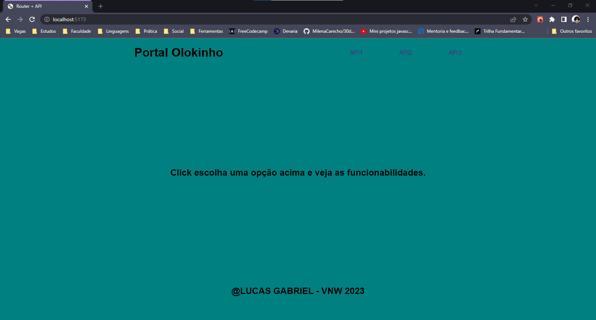

# Vai na Web - To Do

This is a solution for VNW To Do. Exercise proposed by [Vai na Web](https://vainaweb.com.br/) in the Front-End Developer course.

## Table of contents

- [Overview](#overview)
  - [Objective](#Objective)
  - [Screenshot](#screenshot)
- [My process](#my-process)
  - [Built with](#built-with)
  - [Guide](#Guide)
- [Author](#author)

## Overview

### Objective

Develop my experience with React, improving my knowledge and learning new features.

### Screenshot

## My process

### Built with

- Semantic [HTML5](https://developer.mozilla.org/pt-BR/docs/Web/HTML) for markup.
- [CSS](https://developer.mozilla.org/pt-BR/docs/Web/CSS) For custom properties.
- [JS](https://developer.mozilla.org/pt-BR/docs/Web/JavaScript) For interactivity.
- [React](https://reactjs.org/) - JS library.
- [Styled-Components](https://styled-components.com/) - React library that allows us to create styling components by writing CSS code inside a JavaScript file.
- [Vite](https://vitejs.dev/) - Vite is a tool with the aim of creating a simple and super fast development environment.
- [Axios](https://axios-http.com/ptbr/docs/intro) Axios is a promise-based HTTP client for node.js and the browser.
- [React-Routes-Dom](https://reactrouter.com/en/main) Is a library for React created with the objective of solving routing problems for the pages of a website and making development much simpler and scalable.

### Guide

- Download the repository.
- Open the folder in the terminal.
- Run "npm install" and then "npm run dev".
- Done, you will be running the vite server at "http://localhost:5173/"

## Author

- LinkedIn - [Lucas-Gabriel](hhttps://www.linkedin.com/in/yami-kagayaki/)
- Frontend Mentor - [Yami-Kagayaki](https://www.frontendmentor.io/profile/Yami-Kagayaki)
